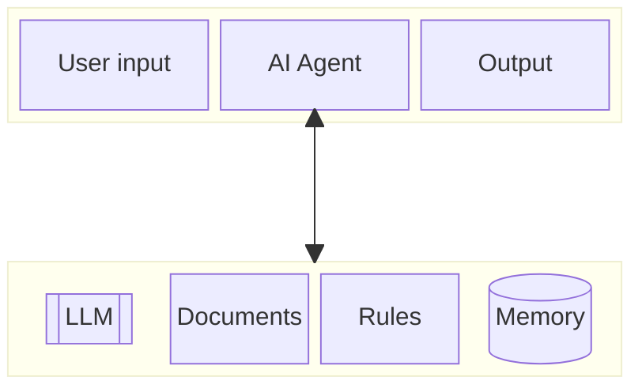

# Exelvision Project


## Introduction

Le but est de permettre d'avoir un maximum de ressource concernanant les ordinateurs Exelvision.

Trouver les sources des logiciels publiés.
En particulier dans les revues comme : Hebdogiciel, Tilt, etc.

Concerne les ordinateurs:
- EXL100
- EXELTEL

Première annonce vers mai 1984.\
Mis sur le marché en septembre 1984, donc recherche à partir de cette date dans les revues de l'époque.\
Fin de production ?\
Liquidation de la société Exelvision ?.


Ce travail est 100% bénévole, n'hésitez pas à me filer un tips, ça me payera le café.


## Objectifs

### 1 - Augmenter le parc logiciel.

Nommage TOSEC, pour inclusion dans les DAT TOSEC.

https://www.tosecdev.org/tosec-naming-convention

Title version (demo) (date)(publisher)(system)(video)(country)(language)(copyright)(devstatus)(media type)(media label)[cr][f][h][m][p][t][tr][o][u][v][b][a][!][more info]

"For the TOSEC manager of EXELVISION, the source code provided here is exactly as published in the magazines or books. Any other version should be regarded as an alternative.

Voir aussi mon projet RPUFOS.

### 2 - Créer un Agent Exelvision

#### Explications
IA (LLM) et Système Expert.\
Mise au point d'un agent dédié Exelvision.\
Préparation pour une database.
- Documents
  - Listings Basic
  - Listings assembleur
- Règles (Rules)
  - json (?)
  - autre (?)

#### Schéma d'un agent IA



Principe :\
Vous posez une question à l'agent qui répond uniquement dans le contexte d'Exelvision.\
Car le système se basera uniquement sur les règles et documents qu'il possède.\
Comme il est aussi branché sur un LLM, il doit pouvoir corriger et/ou créer du code pour les ordinateurs.

J'utilise le terme Système Expert, car ceux-ci sont constitués de règle et d'une base de connaissance (les documents).


___
## Ressources

Si vous avez les codes sources, merci de me le faire savoir afin que je les ajoute.

### Sources Web

https://abandonware-magazines.org/

http://dcexel.free.fr/

https://www.ti99.com/exelvision/website/

https://www.archive.org/


### Status

The current state of each program's porting process is indicated by the icons shown in the following table.

| Icon | Label |
|------|-------|
|  ✅  | Finished and working |
|  ❌  | Failed |
|  ❕  |The source code should be cross-checked with the published version |
|  📝  | Source code to be found or entered |
|  ✘  | Not possible |


| ref  | Commentaire                             |
|------|-----------------------------------------|
| T    | Type                                    |
| Bas  | Source format Basic                     |
| K7   | fichier cassette emulation              |
| Wav  | Fichier WAV pour magnétophone           |
| CRAM | Exelmémoire 16k (EXL100); 64K (Exeltel) |
| BKP  | Sauvegarde K7 Exelmémoire               |

Pour la colonne T (Type) :

| T  | Commentaire                             |
|------|-----------------------------------------|
| A | Applications                               |
| C | Compilations                               |
| E | Educational                                |
| D | Demos                                      |
| G | Games                                      |


L'Exlmémoire dispose d'une pile, mais le changement de pile fait perdre toutes les données. D'où la nécessité d'une sauvegarde (BKP).

Les cassettes audio n'étant plus fabriquées, le fichier Wav sert de remplacement.\
Il est tout à fait possible de copier le WAV sur une cassette si vous en possédez.\
Cependant utiliser un player MP3 doit faire l'affaire.

___
### David H. Ahl

Voir le projet [RPUFOS](https://github.com/VFD/RPUFOS).\
L'idée est d'adapter en force brute tous ses programmes.\
C'est long et fastidieux...

___
### Exelement Votre

Publié par Exelvision. 19 numéros (2 doubles).\
Analyse en cours. Mais déjà pas mal de choses.


| No    | Source                             | Bas | K7 | Wav | FD | CRAM | BKP |
|-------|------------------------------------|-----|----|-----|----|------|-----|
| 01    | Exelplot                           | ❕ |  |  |  |  |  |
| 01    | Exelspace                          | 📝 |  |  |  |  |  |
| 01    | Courbes Mathematique               | 📝 |  |  |  |  |  |
| 01    | Folklore Americain                 | ❕ |  |  |  |  |  |
| 01    | Generation de Note Musicale        | ❕ |  |  |  |  |  |
| 01    | Votre Biorythme                    | ❕ |  |  |  |  |  |
| 02    | Boite a Rythme - Exeldrum          | 📝 |  |  |  |  |  |
| 02    | Dynamique                          | 📝 |  |  |  |  |  |
| 02    | Exelastre                          | 📝 |  |  |  |  |  |
| 02    | Labyrinthe                         | 📝 |  |  |  |  |  |
| 02    | Pedago                             | 📝 |  |  |  |  |  |
| 03    | Editeur de Texte                   | 📝 |  |  |  |  |  |
| 04    | Horloge Horaire                    | ❕ |  |  |  |  |  |
| 05    | Tresors et Fantomes                | 📝 |  |  |  |  |  |
| 05    | Recopie Ecran                      | 📝 |  |  |  |  |  |
| 05    | ASM vers Data Basic                | 📝 |  |  |  |  |  |
| 06    | Mille-Pates                        | ❕ |  |  |  |  |  |
| 07-08 | Ile maudite, L                     | 📝 |  |  |  |  |  |
| 09    | Ile maudite, L \[FD\]              | 📝 | ✘ | ✘ |  |  |  |
| 09    | Mini Budget                        | 📝 |  |  |  |  |  |
| 09    | Auto Question                      | ❕ |  |  |  |  |  |
| 09    | Calepin                            | 📝 |  |  |  |  |  |
| 10    | Editeur de texte Cursif            | 📝 |  |  |  |  |  |
| 10    | Football                           | 📝 |  |  |  |  |  |
| 11    | Jeu de Cartes                      | 📝 |  |  |  |  |  |
| 11    | Micro Facturation                  | 📝 |  |  |  |  |  |
| 11    | Poker                              | 📝 |  |  |  |  |  |
| 12    | Exeldomino                         | 📝 |  |  |  |  |  |
| 13    | Facturation                        | 📝 |  |  |  |  |  |
| 14    | Calendrier Perpetuel               | 📝 |  |  |  |  |  |
| 14    | Europe et Tableau                  | 📝 |  |  |  |  |  |
| 14    | Menu Deroulant                     | 📝 |  |  |  |  |  |
| 15    | Histogramme                        | 📝 |  |  |  |  |  |
| 16    | Fichier d'Adresses                 | 📝 |  |  |  |  |  |
| 17-18 | Tarot                              | ❕ |  |  |  |  |  |
| 19    | Civil War                          | 📝 |  |  |  |  |  |
| 20    | Jeu de la Vie, Le                  | 📝 |  |  |  |  |  |
| 20    | Test et QI                         | 📝 |  |  |  |  |  |
| 20    | Vie a Deux                         | 📝 |  |  |  |  |  |
| Last  | Star Trek                          | ❕ |  |  |  |  |  |

**Civil War** : est l'adaptation sur EXL100 du jeu publié par David H. Ahl.\
**Star Trek** : est l'adaptation sur EXL100 du jeu publié par David H. Ahl.

___
### Exelvision

à faire.

___
### ABC Informatique

Il s'agit d'une encyclopédie.\
3 listings trouvé à date.

| No | Source                              | T | Bas | K7 | Wav | FD | CRAM | BKP |
|----|-------------------------------------|---|-----|----|-----|----|------|-----|
| 87 | Exocet                              | G | ❕ |  |  |  |  |  |
| 89 | Numerix                             | G | ❕ |  |  |  |  |  |
| 90 | Atterissage                         | G | ❕ |  |  |  |  |  |

Les listings sont signés SYBEX.

NDR : Erreur de nom de répertoire à corriger.


___
### Hebdogiciel

Revue française très connu par chez nous, au ton acerbe.\
50 références à date.\
Je crois qu'il y a tout dans la liste ci-dessous.

| No        | Source                          | Bas | K7 | Wav | FD | CRAM | BKP |
|-----------|---------------------------------|-----|----|-----|----|------|-----|
| 58        | Exelbad                         | 📝 |  |  |  |  |  |
| 60        | Barman                          | ❕ |  |  |  |  |  |
| 66        | Exelblitz                       | 📝 |  |  |  |  |  |
| 67 à 69   | Exelmanoir                      | ❕ |  |  |  |  |  |
| 70        | Croc en pomme                   | 📝 |  |  |  |  |  |
| 71        | TMS7020                         | ❕ |  |  |  |  |  |
| 71, 72    | Vocabulaire latin               | 📝 |  |  |  |  |  |
| 72        | Jackpot                         | ❕ |  |  |  |  |  |
| 73        | Générateur de caractère         | ❕ |  |  |  |  |  |
| 74        | Réunion                         | ❕ |  |  |  |  |  |
| 75 à 76   | Exelabyrinthe                   | ❕ |  |  |  |  |  |
| 77        | Brique                          | ❕ |  |  |  |  |  |
| 78        | Salaire                         | ❕ |  |  |  |  |  |
| 79        | Exelstar                        | ❕ |  |  |  |  |  |
| 80 à 81   | Saturne 3                       | ❕ |  |  |  |  |  |
| 82        | Chenille                        | ❕ |  |  |  |  |  |
| 83        | Atlant-Eat                      | ❕ |  |  |  |  |  |
| 84 à 86   | Exeldessin                      | 📝 |  |  |  |  |  |
| 87        | 3D Teuf Teuf                    | ❕ |  |  |  |  |  |
| 88        | Perspective                     | ❕ |  |  |  |  |  |
| 89 à 90   | Sir Lancelot                    | ❕ |  |  |  |  |  |
| 91 à 93   | Zombie                          | ❕ |  |  |  |  |  |
| 94 à 97   | Citronnade                      | ❕ |  |  |  |  |  |
| 94 à 97   | EXEL Missil                     | ❕ |  |  |  |  |  |
| 94        | Exelmusic                       | ❕ |  |  |  |  |  |
| 94        | Patrouille Lunaire              | ❕ |  |  |  |  |  |
| 98 à 99   | Nocturnes                       | ❕ |  |  |  |  |  |
| 100       | Strife                          | ❕ |  |  |  |  |  |
| 101 à 102 | Star Wars                       | ❕ |  |  |  |  |  |
| 103 à 104 | Stress                          | ❕ |  |  |  |  |  |
| 105       | Rallye                          | ❕ |  |  |  |  |  |
| 107 à 108 | Démon d'Exelvision, Le          | ❕ |  |  |  |  |  |
| 109 à 111 | Exelchateau                     | ❕ |  |  |  |  |  |
| 112 à 115 | De l'or ou la mort              | ❕ |  |  |  |  |  |
| 116 à 120 | Chevaux                         | ❕ |  |  |  |  |  |
| 121 à 123 | Haltéro                         | ❕ |  |  |  |  |  |
| 124 à 125 | Exelcar                         | ❕ |  |  |  |  |  |
| 126 à 127 | Territoire                      | ❕ |  |  |  |  |  |
| 128       | Exeldomino                      | ❕ |  |  |  |  |  |
| 129 à 131 | Pinball                         | ❕ |  |  |  |  |  |
| 132 à 133 | Memicon                         | ❕ |  |  |  |  |  |
| 134 à 138 | Tarot                           | ❕ |  |  |  |  |  |
| 139 à 141 | Recherche du Diamant Vert, A la | ❕ |  |  |  |  |  |
| 142 à 145 | Manoir                          | ❕ |  |  |  |  |  |
| 146       | Egnime (Le Cluedo)              | ❕ |  |  |  |  |  |
| 146       | Monkey Kong                     | ❕ |  |  |  |  |  |
| 146       | Tir au pigeon                   | ❕ |  |  |  |  |  |
| 150 à 153 | Exlfrog                         | ❕ |  |  |  |  |  |
| 154 à 159 | Carpathians 1879                | ❕ |  |  |  |  |  |
| 160 à 165 | L'antre                         | ❕ |  |  |  |  |  |
| 166 à 168 | Jump (\*)                       | ❌ |  |  |  |  |  |

(\*) incomplet, car arrêt de publication de la revue.

#### petit listing

No 73 page 12 (2 lignes)\
Laurent MASSETTI

```basic
1 CLS:INPUT "PASSWORD";A$:IF A$=CHR$(63) THEN PRINT "ACCEPTE":END
2 PRINT "ERREUR FATALE ":PAUSE 2:CALL PEEK(14644,A,B):CALL EXEC(56688)
```

No 86 page 10 (2 lignes)\
David SEGONDS

```basic
1 CALL POKE(50688,165,8,6,10):CALL POKE(491556,198,0):CALL POKE(258,2,132)
2 !C'EST DEJA FINI
```

No 106 page 11\
Jean-François MONNET

```basic
1 CALL EXEC(65375)
2 ! TOULOULOU
```

```basic
1 CALL EXEC(65402)
2 ! OOOOHHHHH!!!!!
```


No 129 page 12\
Christophe SASSOLAS

```basic
100 CALL POKE(50688,165,8,6,10):CALL POKE(49156,198,0):CALL KEY1(A,B):A=A-30
110 IF B=0 THEN CALL POKE(258,0,0):GOTO 100 ELSE CALL POKE(258,A,147):GOTO 100
```


___
### Tilt

Revue française sur les jeux vidéos.\
Pendant un temps on y trouvait des listing.\
J'en ai peut-être manqué.

Test EXL100 no15 p26 .\
Test Exeltel no39 p88.

12 références.

| No  | Source                  | Bas | K7 | Wav | FD | CRAM | BKP |
|-----|-------------------------|-----|----|-----|----|------|-----|
| 029 | Table de Multiplication | ❕ |  |  |  |  |  |
| 033 | Frikimmo                | ❕ |  |  |  |  |  |
| 035 | Loto Sportif            | 📝 |  |  |  |  |  |
| 035 | Pendu des Animaux, Le   | ❕ |  |  |  |  |  |
| 036 | Carnet d'Adresses       | ❕ |  |  |  |  |  |
| 037 | Corbeau et Renard, Le   | ❕ |  |  |  |  |  |
| 037 | Char en Folie, Le       | 📝 |  |  |  |  |  |
| HS  | Clavier Bavard          | ❕ |  |  |  |  |  |
| HS  | Crayon Magique          | ❕ |  |  |  |  |  |
| HS  | Formule 1               | ❕ |  |  |  |  |  |
| HS  | Musicorgue              | ❕ |  |  |  |  |  |
| HS  | Threat Star             | 📝 |  |  |  |  |  |

HS : Hors Série, Mars 1987, 240 listings.

___
### Votre Ordinateur

1 seul trouvé dans le N° 15 juillet-août 1985.

| No | Source                              | T | Bas | K7 | Wav | FD | CRAM | BKP |
|----|-------------------------------------|---|-----|----|-----|----|------|-----|
| 15 | Kim Musical                         | G | ❕ |  |  |  |  |  |

Le listing sera aussi publié dans « EXL100 à l'école » plus tard dans l'année.

___
### L'Ordinateur individuel

En cours.

___
### PSI : 102 Programmes

Livre daté de Janvier 1985.\
Contient 101 programme et une aide au basic considérée comme 102ème.


| No  | Source                  | Bas | K7 | Wav | FD | CRAM | BKP |
|-----|-------------------------|-----|----|-----|----|------|-----|
| 001 | Nombre Mysterieux, Le   | ❕ |  |  |  |  |  |
| 002 | Cube                    | ❕ |  |  |  |  |  |
| 003 | Chaud, Froid            | ❕ |  |  |  |  |  |
| 004 | Allumettes, Les         | ❕ |  |  |  |  |  |
| 005 | Allumettes a Plusieurs  | ❕ |  |  |  |  |  |
| 006 | Calendrier Perpetuel    | ❕ |  |  |  |  |  |
| 007 | Bataille Naval          | ❕ |  |  |  |  |  |
| 008 | Golf                    | ❕ |  |  |  |  |  |
| 009 | Solfège                 | ❕ |  |  |  |  |  |
| 010 | Jeu du 21, Le           | ❕ |  |  |  |  |  |
| 011 | Pair - Impair           | ❕ |  |  |  |  |  |
| 012 | Devine un Chiffre       | ❕ |  |  |  |  |  |
| 013 | Jeu de Witthof          | ❕ |  |  |  |  |  |
| 014 | Rebonds                 | ❕ |  |  |  |  |  |
| 015 | Jackpot                 | ❕ |  |  |  |  |  |
| 016 | Couloirs                | ❕ |  |  |  |  |  |
| 017 | Echiquier               | ❕ |  |  |  |  |  |
| 018 | Jeu de la Feve          | ❕ |  |  |  |  |  |
| 019 | Jeu de l'Oie Aleatoire  | ❕ |  |  |  |  |  |
| 020 | De Truque               | ❕ |  |  |  |  |  |
| 021 | Visions                 | ❕ |  |  |  |  |  |
| 022 | 421                     | ❕ |  |  |  |  |  |
| 023 | Electricien fou, L      | 📝 |  |  |  |  |  |
| 024 | Course au 20, La        | ❕ |  |  |  |  |  |
| 025 | Musique                 | ❕ |  |  |  |  |  |
| 026 | Poker                   | ❕ |  |  |  |  |  |
| 027 | Jeu de Saute-Mouton     | ❕ |  |  |  |  |  |
| 028 | Lettres                 | 📝 |  |  |  |  |  |
| 029 | Machinamot              | 📝 |  |  |  |  |  |
| 030 | Espion                  | 📝 |  |  |  |  |  |
| 031 | Accrochez les Wagons    | 📝 |  |  |  |  |  |
| 032 | Tirage d'un De Truque   | 📝 |  |  |  |  |  |
| 033 | Tour de Carte           | 📝 |  |  |  |  |  |
| 034 | Jeu de Marienbad        | 📝 |  |  |  |  |  |
| 035 | Indésirable, L          | 📝 |  |  |  |  |  |
| 036 | Compose                 | 📝 |  |  |  |  |  |
| 037 | Jour de la Semaine      | 📝 |  |  |  |  |  |
| 038 | Jeu de la Vie, Le       | 📝 |  |  |  |  |  |
| 039 | De, Un                  | 📝 |  |  |  |  |  |
| 040 | Plus Grand, Plus Petit  | 📝 |  |  |  |  |  |
| 041 | Ordre                   | 📝 |  |  |  |  |  |
| 042 | Pendu, Le               | 📝 |  |  |  |  |  |
| 043 | Belote                  | 📝 |  |  |  |  |  |
| 044 | Taquin de Calcul, Un    | 📝 |  |  |  |  |  |
| 045 | Pendu Inverse           | 📝 |  |  |  |  |  |
| 046 | Nicomaque               | 📝 |  |  |  |  |  |
| 047 | Course de Chevaux       | 📝 |  |  |  |  |  |
| 048 | Travers, A              | 📝 |  |  |  |  |  |
| 049 | Mastermind              | 📝 |  |  |  |  |  |
| 050 | Idem                    | 📝 |  |  |  |  |  |
| 051 | Horloge                 | 📝 |  |  |  |  |  |
| 052 | Reines sur l'Echiquier  | 📝 |  |  |  |  |  |
| 053 | Repetitions             | 📝 |  |  |  |  |  |
| 054 | Mots                    | 📝 |  |  |  |  |  |
| 055 | Permutations            | 📝 |  |  |  |  |  |
| 056 | Bridge                  | 📝 |  |  |  |  |  |
| 057 | Hanoi                   | 📝 |  |  |  |  |  |
| 058 | Losanges                | 📝 |  |  |  |  |  |
| 059 | Mathieu                 | 📝 |  |  |  |  |  |
| 060 | Loup et les Agneaux, Le | 📝 |  |  |  |  |  |
| 061 | Moivre                  | 📝 |  |  |  |  |  |
| 062 | Trace de Courbe         | 📝 |  |  |  |  |  |
| 063 | Tirage de De            | 📝 |  |  |  |  |  |
| 064 | Jeu de Loto             | 📝 |  |  |  |  |  |
| 065 | Bombe, La               | 📝 |  |  |  |  |  |
| 066 | Ardoise Magique         | 📝 |  |  |  |  |  |
| 067 | Affichage Publicitaire  | 📝 |  |  |  |  |  |
| 068 | Evasion                 | 📝 |  |  |  |  |  |
| 069 | Combat Aerien           | 📝 |  |  |  |  |  |
| 070 | Dessin de De            | 📝 |  |  |  |  |  |
| 071 | Jeu du Missile          | 📝 |  |  |  |  |  |
| 072 | Singe, Le               | 📝 |  |  |  |  |  |
| 073 | Jeu du 15, Le           | 📝 |  |  |  |  |  |
| 074 | Adresse                 | 📝 |  |  |  |  |  |
| 075 | Sous-Marin              | 📝 |  |  |  |  |  |
| 076 | Zombies                 | 📝 |  |  |  |  |  |
| 077 | Diago                   | 📝 |  |  |  |  |  |
| 078 | Decomaque               | 📝 |  |  |  |  |  |
| 079 | Chasse au Sous-Marin    | 📝 |  |  |  |  |  |
| 080 | Clavier                 | 📝 |  |  |  |  |  |
| 081 | Calculatrice            | 📝 |  |  |  |  |  |
| 082 | Reflexe                 | 📝 |  |  |  |  |  |
| 083 | Smokey                  | 📝 |  |  |  |  |  |
| 084 | Course de Voiture       | 📝 |  |  |  |  |  |
| 085 | Echecs                  | 📝 |  |  |  |  |  |
| 086 | Danger Spacial          | 📝 |  |  |  |  |  |
| 087 | Tic Tac Toe             | 📝 |  |  |  |  |  |
| 088 | Dames                   | 📝 |  |  |  |  |  |
| 089 | Quatre a Quatre         | 📝 |  |  |  |  |  |
| 090 | Anagrammes              | 📝 |  |  |  |  |  |
| 091 | Oeufs                   | 📝 |  |  |  |  |  |
| 092 | Taquin de Lettres       | 📝 |  |  |  |  |  |
| 093 | Cibles                  | 📝 |  |  |  |  |  |
| 094 | Gouttes                 | 📝 |  |  |  |  |  |
| 095 | Obstacles               | 📝 |  |  |  |  |  |
| 096 | Captures dans l'Espace  | 📝 |  |  |  |  |  |
| 097 | Anomalie                | 📝 |  |  |  |  |  |
| 098 | Plusieurs en Un         | 📝 |  |  |  |  |  |
| 099 | Parcours du Cavalier    | 📝 |  |  |  |  |  |
| 100 | Mur de Brique           | 📝 |  |  |  |  |  |
| 101 | Othello                 | 📝 |  |  |  |  |  |
| 102 |                         | 📝 |  |  |  |  |  |


___
### Minipuce : 25 Programmes

Livre publié en Octobre 1985.\
Pour le 25 ce sont des compléments à la programmation en Basic.

Il y a aussi 3 programmes de tris.


| No | Source                              | T | Bas | K7 | Wav | FD | CRAM | BKP |
|----|-------------------------------------|---|-----|----|-----|----|------|-----|
| 01 | Calculette                          | A | ❕ |  |  |  |  |  |
| 02 | Dates                               | A | ❕ |  |  |  |  |  |
| 03 | Dump                                | A | ❕ |  |  |  |  |  |
| 04 | Fonctions Complementaires           | A | ❕ |  |  |  |  |  |
| 05 | Histogramme                         | A | ❕ |  |  |  |  |  |
| 06 | Initialisation Imprimante           | A | ❕ |  |  |  |  |  |
| 07 | Message Defilant                    | A | ❕ |  |  |  |  |  |
| 08 | Operation sur Valeurs Hexadecimales | A | ❕ |  |  |  |  |  |
| 09 | Plan                                | A | ❕ |  |  |  |  |  |
| 10 | Pronostics Tierce                   | A | ❕ |  |  |  |  |  |
| 11 | Tris Numérique                      | A | ❕ |  |  |  |  |  |
| -- | Tris Alphanumérique                 | A | ❕ |  |  |  |  |  |
| -- | Méthodes de Tri                     | A | ❕ |  |  |  |  |  |
| 12 | Barman                              | G | ❕ |  |  |  |  |  |
| 13 | Bombardier                          | G | ❕ |  |  |  |  |  |
| 14 | Citation                            | E | ❕ |  |  |  |  |  |
| 15 | Coeur Secret                        | G | ❕ |  |  |  |  |  |
| 16 | Jeu des Stations de Metro           | G | ❕ |  |  |  |  |  |
| 17 | Rouge et le Noir, Le                | G | ❕ |  |  |  |  |  |
| 18 | Loto                                | A | ❕ |  |  |  |  |  |
| 19 | Petanque                            | G | ❕ |  |  |  |  |  |
| 20 | Sahara                              | G | ❕ |  |  |  |  |  |
| 21 | Suite Logique                       | E | ❕ |  |  |  |  |  |
| 22 | Tapis Vert                          | G | ❕ |  |  |  |  |  |
| 23 | Taquin Rotatif                      | G | ❕ |  |  |  |  |  |
| 24 | Theme Astral                        | A | ❕ |  |  |  |  |  |
| 25 | (\*)                                | E | ❕ |  |  |  |  |  |

(\*) Complément basic. Plusieurs listing. Mis en MarkDown.

TO DO: Valider tous les sources.

___
### EXL100 à l'école

21 programmes, ceux-ci pouvant être modifiable pour être mieux adaptés au contexte scolaire.

| No | Source                  | T | Bas | K7 | Wav | FD | CRAM | BKP |
|----|-------------------------|---|-----|----|-----|----|------|-----|
| 01 | Kim Musical             | E | ❕ |  |  |  |  |  |
| 02 | Autodictée              | E | ❕ |  |  |  |  |  |
| 03 | Soutien                 | E | ❕ |  |  |  |  |  |
| 04 | Safari                  | E | ❕ |  |  |  |  |  |
| 05 | Lecture Rapide          | E | ❕ |  |  |  |  |  |
| 06 | Lecture Débutant        | E | ❕ |  |  |  |  |  |
| 07 | Pluriel des noms        | E | ❕ |  |  |  |  |  |
| 08 | Conjugaison             | E | ❕ |  |  |  |  |  |
| 09 | Addition                | E | ❕ |  |  |  |  |  |
| 10 | Soustraction            | E | ❕ |  |  |  |  |  |
| 11 | Multiplication          | E | ❕ |  |  |  |  |  |
| 12 | Division                | E | ❕ |  |  |  |  |  |
| 13 | Ravitaillement en Vol   | E | ❕ |  |  |  |  |  |
| 14 | Train Capricieux, Le    | E | ❕ |  |  |  |  |  |
| 15 | Ville de France         | E | ❕ |  |  |  |  |  |
| 16 | Consruction de Phrases  | E | ❕ |  |  |  |  |  |
| 17 | J'Ecris tout seul       | E | ❕ |  |  |  |  |  |
| 18 | Reconstitution de texte | E | ❕ |  |  |  |  |  |
| 19 | Coktail Magique         | E | ❕ |  |  |  |  |  |
| 20 | Masse et Volume         | E | ❕ |  |  |  |  |  |
| 21 | Kim Nombre              | E | ❕ |  |  |  |  |  |

___
### RPUFOS

GAM JAM 2022.


___
### Autres

#### Edition PUSSY

Annecdote : Edition PUSSY n'a jamais existé, c'est un pseudo de programmeur (Walter FILLON).\
cf. : http://miniordi.free.fr/exl100

| Source                              | T | Bas | K7 | Wav | FD | CRAM | BKP |
|-------------------------------------|---|-----|----|-----|----|------|-----|
| Air-Ball                            | G | ✅ | ✅ | ✅ |  |  |  |
| Direct (Utilitaire)                 | A | ✅ | ✅ | ✅ |  |  |  |
| Donkey Kong (Remake)                | G | ✅ | ✅ | ✅ |  |  |  |
| Dynamite-Ball                       | G | ✅ | ✅ | ✅ |  |  |  |
| Dynamite-Ball V2                    | G | ✅ | ✅ | ✅ |  |  |  |
| Echecs-Dames                        | G | ✅ | ✅ | ✅ |  |  |  |
| Hamburger (Remake)                  | G | ✅ | ✅ | ✅ |  |  |  |
| Keys-Ball III                       | G | ✅ | ✅ | ✅ |  |  |  |
| Keys-Ball PRO                       | G | ✅ | ✅ | ✅ |  |  |  |
| Labyrinthe in the Pyramide          | G | ✅ | ✅ | ✅ |  |  |  |
| Le petit pendu junior               | G | ✅ | ✅ | ✅ |  |  |  |
| Lecture (Le Monstre du Lac Noir)    | G | ✅ | ✅ | ✅ |  |  |  |
| Loto                                | A | ✅ | ✅ | ✅ |  |  |  |
| Maze-Ball                           | G | ✅ | ✅ | ✅ |  |  |  |
| Pacific                             | G | ✅ | ✅ | ✅ |  |  |  |
| Parsec (remake)                     | G | ✅ | ✅ | ✅ |  |  |  |
| Space Runner                        | G | ✅ | ✅ | ✅ |  |  |  |
| Super Line 4                        | G | ✅ | ✅ | ✅ |  |  |  |
| Tire Croise                         | G | ✅ | ✅ | ✅ |  |  |  |
| Track-Ball                          | G | ✅ | ✅ | ✅ |  |  |  |
| Vampire                             | G | ✅ | ✅ | ✅ |  |  |  |


#### Minitel

Il y avait beaucoup de logiciels via le Minitel.\
On ne désespère pas de tomber sur des K7 pépites ou autres pour les avoir.

#### ToSort

Le bazar...\
:-)\
Fourre tout de listing inconnus et à trier.


___


